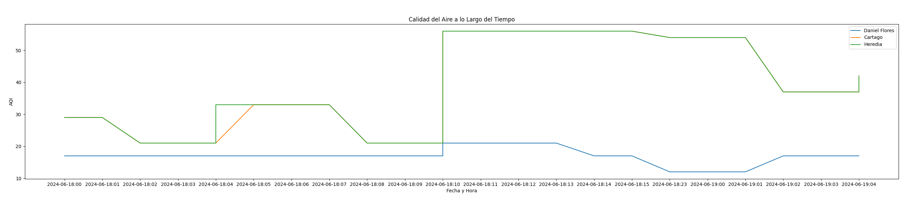

# Análisis Exploratorio de Datos

A continuación se muestra un primer análisis exploratorio de los datos recolectados en 1 día y 4 horas del 18 de junio al 19 de junio.

<em>Figura 1: Calidad del aire a lo largo del tiempo</em>

Esta gráfica muestra cómo varía el Índice de Calidad del Aire (AQI) en tres ubicaciones diferentes (Daniel Flores, Cartago y Heredia) a lo largo del tiempo.
Observaciones:
Daniel Flores tiene niveles de AQI relativamente bajos y estables, sin grandes fluctuaciones.
Cartago y Heredia muestran mayores variaciones en el AQI. Por ejemplo, Heredia tiene un pico inicial que luego disminuye y se mantiene relativamente estable.

<em>Figura 2: Boxplot</em>

Los box plots comparan la distribución del AQI en las tres ubicaciones.
Observaciones:
Cartago y Heredia tienen distribuciones de AQI muy similares, con rangos de valores altos y medianas similares.
Daniel Flores tiene valores de AQI mucho más bajos en comparación, con una mediana y un rango inferior a las otras ubicaciones.
Existen algunos valores atípicos (outliers) en Daniel Flores, indicando algunas mediciones de AQI más bajas de lo habitual.

<em>Figura 3: Distribución del AQI por ubicación</em>

Esta gráfica muestra la distribución de frecuencias del AQI en las tres ubicaciones.
Observaciones:
Daniel Flores tiene una distribución más concentrada en valores bajos de AQI, con un pico alrededor de 17.
Cartago y Heredia tienen distribuciones más dispersas con picos alrededor de 35-40 y algunas mediciones alrededor de 50.

<em>Figura 4: Ajuste de distribución normal</em>

***

## Momentos

A continuación se muestra una tabla con los momentos analizados a partir de los datos recolectados:

| City Name     | Media      | Varianza    | Desviación Estándar  | Inclinación (Skewness) | Kurtosis  |
|---------------|------------|-------------|----------------------|------------------------|-----------|
| Cartago       | 37.684641  | 192.618880  | 13.878720            | 0.197262               | -1.503012 |
| Daniel Flores | 17.155229  | 5.090431    | 2.256198             | -0.382547              | 1.127140  |
| Heredia       | 37.654664  | 192.383827  | 13.870250            | 0.200666               | -1.500147 |

*Tabla 2: Momentos*

Media (μ):

Cartago y Heredia tienen medias muy similares (~37.68 y ~37.65, respectivamente), indicando niveles de AQI relativamente altos en promedio.
Daniel Flores tiene una media mucho más baja (~17.16), lo que sugiere una mejor calidad del aire en esta ubicación.

Varianza (σ²):

La varianza de Cartago y Heredia es muy similar (~192), indicando que hay una dispersión significativa en los niveles de AQI.
Daniel Flores tiene una varianza mucho menor (~5.09), lo que significa que los niveles de AQI son más consistentes y estables.

Desviación Estándar (σ):

Similar a la varianza, la desviación estándar es alta para Cartago y Heredia (~13.88 y ~13.87) y baja para Daniel Flores (~2.26).

Inclinación (Skewness):

Cartago y Heredia tienen una inclinación ligeramente positiva (0.2), lo que indica una ligera asimetría hacia valores más altos de AQI.
Daniel Flores tiene una inclinación negativa (-0.38), sugiriendo una ligera asimetría hacia valores más bajos de AQI.

Kurtosis:

Las kurtosis de Cartago y Heredia (~-1.5) indican una distribución más plana que la normal, lo que significa que hay menos valores extremos.
Daniel Flores tiene una kurtosis positiva (~1.13), indicando una distribución más puntiaguda, con más valores concentrados alrededor de la media.

***

## Ecuaciones de Distribuciones y Momentos

Para cada ubicación, ajustamos una distribución normal a los datos de AQI. La ecuación de la distribución normal es:

$$
f(x) = \frac{1}{\sigma \sqrt{2\pi}} \exp\left(-0.5 \left(\frac{x - \mu}{\sigma}\right)^2\right)
$$

Dónde:
- $\mu$ es la media de los datos.
- $\sigma$ es la desviación estándar de los datos.

Los momentos de la distribución son:

- **Media ($\mu$)**:

$$
\mu = \frac{1}{N} \sum_{i=1}^N x_i
$$

- **Varianza ($\sigma^2$)**:

$$
\sigma^2 = \frac{1}{N} \sum_{i=1}^N (x_i - \mu)^2
$$

- **Desviación estándar ($\sigma$)**:

$$
\sigma = \sqrt{\sigma^2}
$$

- **Inclinación (Asimetría)**:

$$
\text{Asimetría} = \frac{1}{N} \sum_{i=1}^{N} \left(\frac{x_i - \mu}{\sigma}\right)^3 -3
$$

- **Curtosis**:

$$
\text{Curtosis} = \frac{1}{N} \sum_{i=1}^N \left(\frac{x_i - \mu}{\sigma}\right)^4 - 3
$$

