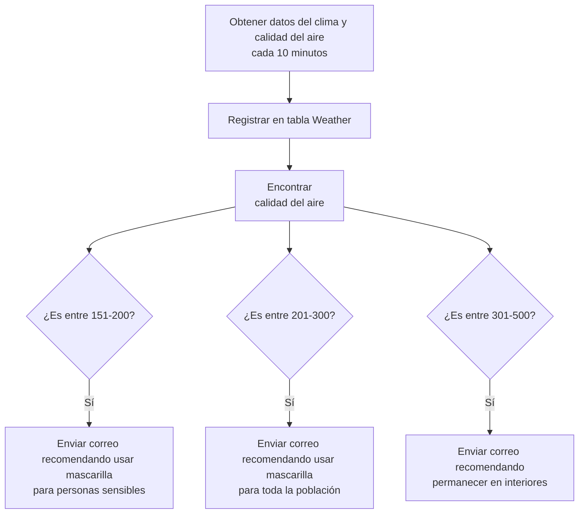

# **UNIVERSIDAD DE COSTA RICA**
### Escuela de Ingeniería Eléctrica
### IE0405 - Modelos Probabilísticos de Señales y Sistemas
### Proyecto de programación  

---

**Integrantes:**

- Mariano Segura Chaves C17416
- Leonardo Serrano Arias C17484
- Leonardo Leiva Vásquez C14172

***

**Profesor:** Fabián Abarca Calderón

11 de julio de 2024

---

## Introducción

Este proyecto tiene como objetivo analizar la calidad del aire en diferentes zonas de Costa Rica, utilizando datos recolectados en tiempo real. Se enfocará en tres áreas específicas: dos zonas muy concurridas del Gran Área Metropolitana (Heredia y Cartago) y una zona menos concurrida (Pérez Zeledón). La comparación de la calidad del aire entre estas áreas permitirá evaluar el impacto del tráfico vehicular, entre otras fuentes de contaminación, con el objetivo alertar a los habitantes caundo exista algún riesgo.

***

## Pregunta de Investigación
¿Cómo varía la calidad del aire en tres diferentes zonas de Costa Rica como lo son Heredia, Cartago y Pérez Zeledón, y qué tan efectivo es un sistema de alarmas basado en el índice de calidad del aire (AQI) para alertar a la población sobre niveles peligrosos de contaminación?

***
## Metodología

### Recolección de Datos

Los datos se obtienen cada 10 minutos mediante la API de Weatherbit, abarcando parámetros clave como el Índice de Calidad del Aire (AQI), la presión atmosférica, la velocidad y dirección del viento, la temperatura, la humedad relativa, entre otros. Estos datos se almacenan en una base de datos para su posterior análisis. A continuación se muestra una tabla con la recopilación de los datos por recolectar, explicando sus unidades y el significado de cada uno:

A continuación se muestra una tabla con la recopilación de los datos recolectados, explicando sus unidades y el significado de cada uno:

| Data         | Description                                       | Units                   |
|--------------|---------------------------------------------------|-------------------------|
| aqi          | Air Quaity Index                                  | US EPA standard 0-500   |
| lat          | Latitude                                          | Degrees                 |
| lon          | Longitude                                         | Degrees                 |
| timezone     | Local IANA Timezone                               | —                       |
| ob_time      | Last observation time                             | (YYYY-MM-DD HH:MM)      |
| datetime     | Current cycle hour                                | (YYYY-MM-DD:HH)         |
| city_name    | City name                                         | —                       |
| country_code | Country abbreviation                              | —                       |
| pres         | Pressure                                          | (mb)                    |
| wind_spd     | Wind speed                                        | (m/s)                   |
| wind_dir     | Wind direction                                    | Degrees                 |
| temp         | Temperature                                       | (Celsius)               |
| app_temp     | Apparent/"Feels Like" temperature                 | (Celsius)               |
| clouds       | Cloud coverage                                    | (%)                     |
| rh           | Relative humidity                                 | (%)                     |

*Tabla 1: Dato, unidad y descripción de la base de datos que se usarán en el proyecto*

***
### Evaluación y Alerta

El sistema evalúa el AQI cada 10 minutos y envía una alarma a los usuarios registrados si los niveles de AQI superan ciertos umbrales, basados en los estándares de la US EPA. Su objetivo es alertar a las personas con alguna condición médica que les implique tomar las medidas de precaución adecuadas según sea el caso:

- **0-50 (Bueno)**: La calidad del aire se considera satisfactoria y la contaminación del aire presenta poco o ningún riesgo.
- **51-100 (Moderado)**: La calidad del aire es aceptable; sin embargo, para algunos contaminantes puede haber un riesgo moderado para la salud de un número muy reducido de personas que son inusualmente sensibles a la contaminación del aire.
- **101-150 (No saludable para grupos sensibles)**: Las personas con enfermedades respiratorias como el asma, los niños y los ancianos están en mayor riesgo de sufrir efectos para la salud. El público en general no es probable que se vea afectado en este rango de AQI.
- **151-200 (No saludable)**: Todos pueden comenzar a experimentar efectos para la salud; los miembros de grupos sensibles pueden experimentar efectos más graves para la salud.
- **201-300 (Muy no saludable)**: Advertencias sanitarias de condiciones de emergencia. Toda la población se vería afectada.
- **301-500 (Peligroso)**: Alerta sanitaria: todos pueden experimentar efectos más graves para la salud.

En términos de usar una mascarilla:

- **151-200 (No saludable)**: Es recomendable que las personas sensibles (aquellos con condiciones respiratorias, niños, ancianos) usen mascarillas cuando estén al aire libre y reduzcan la actividad física intensa.
- **201-300 (Muy no saludable)**: Se recomienda que toda la población use mascarillas y limiten la exposición al aire libre.
- **301-500 (Peligroso)**: Se aconseja que todas las personas permanezcan en interiores y usen mascarillas si necesitan salir.

***
### Funcionamiento del Sistema de Alarmas

El sistema de alarmas presenta el siguiente modo de funcionamiento:

1. **Recolección de Datos:** Los datos de calidad del aire se recolectan cada hora desde tres ubicaciones diferentes utilizando la API de Weatherbit. Estos datos se almacenan en una base de datos SQLite.
2. **Evaluación de AQI:** Cada 10 minutos, el sistema evalúa el índice de calidad del aire (AQI) para cada ubicación. Dependiendo del valor de AQI, se ejecutan diferentes condiciones (`if`) para determinar si es necesario enviar una alerta.
3. **Condiciones de AQI:** Las alertas se envían en función de los siguientes rangos de AQI:
   - **101-150 (No saludable para grupos sensibles):** Se envía una alerta recomendando que las personas con enfermedades respiratorias, niños y ancianos tomen precauciones.
   - **151-200 (No saludable):** Se envía una alerta indicando que todos pueden experimentar efectos para la salud, y que los grupos sensibles pueden experimentar efectos más graves.
   - **201-300 (Muy no saludable):** Se envía una alerta con advertencias sanitarias de condiciones de emergencia, indicando que toda la población se vería afectada.
   - **301-500 (Peligroso):** Se envía una alerta de emergencia indicando que todos pueden experimentar efectos graves para la salud.
4. **Envío de Correos Electrónicos:** Si se cumple alguna de las condiciones anteriores, se envía un correo electrónico a las personas registradas, informándoles sobre la calidad del aire y las precauciones a tomar.

En el siguiente diagrama de flujo se detalla el funcionamiento de la recolección de datos y el sistema de alertas:

***
