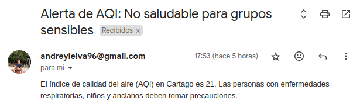
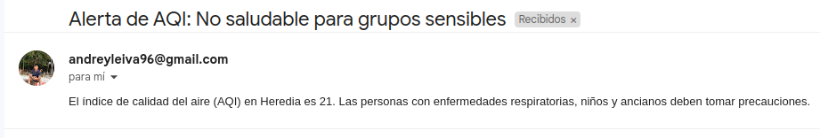
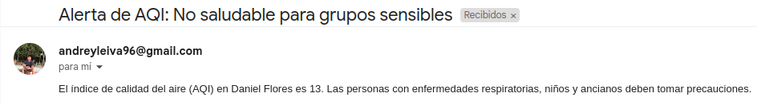

# Resultados

Para poner a prueba el funcionamiento de la alarma, se realizaron algunos ajustes en el umbral de alerta debido a que, en los tres lugares estudiados, el AQI generalmente no alcanza niveles tan altos.

<em>Figura 1: Ejemplo de correo electronico en Cartago</em>

<em>Figura 2: Ejemplo de correo electronico en Heredia</em>

<em>Figura 3: Ejemplo de correo electronico en Daniel Flores, Perez Zeledon</em>

La alarma envía correos electrónicos a las personas registradas cuando se alcanza un umbral peligroso de calidad del aire. Esta emisión de alertas comienzan a partir de un AQI de 101, sin embargo, dado que en los datos recolectados no se alcanzaba ese valor, se decidió reducir el umbral a un AQI de 21 y 13 para comprobar el funcionamiento del sistema, lo cual se puede apreciar en las figuras anteriores, donde para cada región se hizo envío de una alerta. Aunque 21 y 13 indican una calidad de aire muy buena según los estándares internacionales, en este caso, para efectos de la verificación, la alerta significaría un AQI no saludable para grupos sensibles y, por lo tanto, se recomiendan precauciones a personas con enfermedades respiratorias, niños y ancianos.

Las pruebas de funcionamiento del sistema de alarma se realizaron enviando alertas en las tres ubicaciones de estudio: Cartago, Heredia y Daniel Flores, Pérez Zeledón. A continuación, se detallan los resultados:

1. Cartago: La figura 1 muestra un ejemplo del correo electrónico enviado en Cartago cuando el AQI alcanzó el umbral de 21. El mensaje recomienda a las personas con condiciones respiratorias, niños y ancianos que tomen precauciones.

2. Heredia: La figura 2 presenta un ejemplo del correo electrónico enviado en Heredia bajo las mismas condiciones. La alerta aconseja a las personas con condiciones respiratorias, niños y ancianos que tomen precauciones.

3. Daniel Flores, Pérez Zeledón: La figura 3 ilustra el correo electrónico enviado en esta ubicación. Aunque esta zona tiene una calidad del aire generalmente buena, de igual forma el umbral reducido permitió verificar que el sistema de alertas opera adecuadamente.

## Observaciones

* Precisión y Eficiencia: Las pruebas demostraron que el sistema de alarmas es preciso y eficiente en la recolección de datos y el envío de alertas. Cada 10 minutos, el sistema evalúa el AQI y, si se supera el umbral, envía un correo electrónico a los usuarios registrados.

* Adaptabilidad: La reducción del umbral de AQI a 21 o 13, realizado para efectos de comprobación del sistema, permitió validar la capacidad de este para enviar alertas en tiempo real. Esto sugiere que el sistema puede adaptarse fácilmente a diferentes condiciones de calidad del aire y necesidades de la población.

***

# Conclusiones

Daniel Flores se caracteriza por tener una calidad de aire generalmente buena, con niveles de AQI bajos y consistentes a lo largo del tiempo. El análisis de los datos recolectados muestra que la distribución de los valores de AQI es menos variable y los valores están más concentrados alrededor de la media. Esto indica que, en comparación con otras áreas, Daniel Flores mantiene una calidad del aire estable y saludable, con pocas fluctuaciones. La estabilidad y los bajos niveles de AQI sugieren que esta área es menos afectada por factores que deterioran la calidad del aire, como el tráfico vehicular y la actividad industrial. Esta consistencia es particularmente beneficiosa para los residentes, especialmente aquellos con condiciones respiratorias, ya que implica menos exposición a niveles perjudiciales de contaminación.

En contraste, las ubicaciones de Cartago y Heredia presentan niveles de AQI más altos y variables. El análisis de los datos muestra que ambas áreas experimentan mayores fluctuaciones en la calidad del aire, con picos ocasionales que pueden superar los niveles considerados seguros para grupos sensibles, aunque en su mayoría de veces el AQI no representa un peligro real. Las distribuciones de los valores de AQI en estas áreas son más dispersas, lo que indica una mayor variabilidad en la calidad del aire. Estos picos pueden estar asociados con factores como el aumento del tráfico vehicular, actividades industriales, y condiciones meteorológicas adversas que pueden exacerbar la contaminación del aire. Estas fluctuaciones podrían representar un riesgo potencial para la salud pública, especialmente para personas con enfermedades respiratorias, niños y ancianos, quienes son más vulnerables a los efectos nocivos de la contaminación del aire.

La implementación del sistema de alarmas de calidad del aire ha demostrado ser una herramienta muy beneficiosa para la salud pública del país. Este sistema envía alertas en tiempo real cuando los niveles de AQI alcanzan umbrales peligrosos, permitiendo a las personas con condiciones respiratorias tomar decisiones informadas sobre su exposición al aire libre. En situaciones donde la calidad del aire se deteriora, las alertas proporcionan recomendaciones precisas sobre las medidas a tomar, como reducir la actividad física al aire libre, usar mascarillas, o permanecer en interiores. Esto es especialmente crucial en áreas como la GAM, donde los niveles de AQI pueden variar significativamente y alcanzar valores que pueden ser perjudiciales para la salud.

La capacidad del sistema para adaptarse y enviar alertas basadas en datos en tiempo real mejora su efectividad, asegurando que los usuarios reciban información oportuna para proteger su salud. Además, el sistema puede servir como una herramienta educativa, aumentando la conciencia sobre la calidad del aire y su impacto en la salud, y fomentando comportamientos que contribuyan a la mejora de la calidad del aire en la comunidad.

En resumen, el sistema de alarma de calidad del aire ofrece una solución práctica y efectiva para monitorear y gestionar los riesgos asociados con la contaminación del aire. Aunque en este proyecto se analizaron 3 regiones del país, se esperaría que el monitoreo sea a lo largo de los 84 cantones, pues su implementación no solo protege a las personas más vulnerables, sino que también contribuye a la creación de comunidades más saludables y resilientes frente a los desafíos ambientales.
